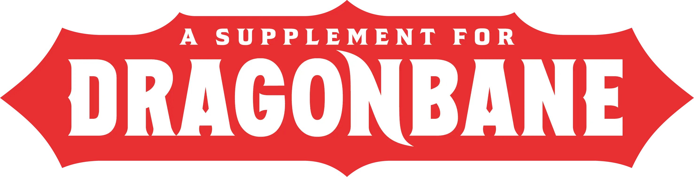
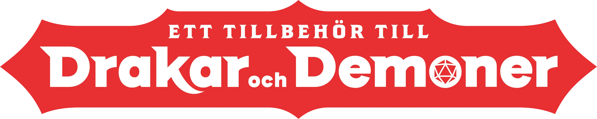

# Item Piles: Dragonbane / Drakar och Demoner

 [](https://forge-vtt.com/bazaar#package=itempiles-dragonbane)  

---

A module made by [Jonas Karlsson](https://github.com/xdy) based on a template
by [Fantasy Computerworks](http://fantasycomputer.works/).

---

## What is Item Piles?

Have you ever wished you could represent items in your scenes? A pile of items, something to interact with - or perhaps
chests whose appearance changes depending on what happens to it, whether it's open, closed, full, or empty. Do you want
an easy way to split loot between players? Do you want easy to use merchants with great UIs?

[Then you need **Item Piles**!](https://foundryvtt.com/packages/item-piles)

## What is this?

This is a module that enables the Dragonbane / Drakar och Demoner Foundry system to work seamlessly with Item Piles.

### Patch Notes:

See [CHANGELOG.md](CHANGELOG.md)

### Contributing

See [CONTRIBUTING.md](CONTRIBUTING.md) and [CONTRIBUTORS.md](CONTRIBUTORS.md)

## The Programmer's Mantra

```

It is by caffeine alone I set my mind in motion
It is by the beans of Java that thoughts acquire speed
The hands acquire shakes
The shakes become a warning
It is by caffeine alone I set my mind in motion

```

* Help xdy stay awake long enough to add more
  bugs! [](https://ko-fi.com/xdy1337)

### Licenses

Project Licensing:

* Everything in this project that is not covered by one of the following license exceptions is made available under the
  MIT License (see [LICENSE.MD](LICENSE.md)) This project is partly based
  on https://github.com/fantasycalendar/FoundryVTT-ItemPilesDnD5e

Virtual Table Top Platform Licenses:

* Foundry VTT support is covered by the following
  license: [Limited License Agreement for module development](https://foundryvtt.com/article/license/).

Dragonbane / Drakar och Demoner third-party license:

* Item Piles Dragonbane är en oberoende publikation av Jonas Karlsson och har ingen koppling till Fria Ligan AB. Den är
  publicerad under tredjepartslicensen för Drakar och Demoner (version 1.0). Drakar och Demoner och Ereb Altor är
  registrerade varumärken tillhörande Fria Ligan AB.

* This game is not affiliated with, sponsored, or endorsed by Fria Ligan AB. This Supplement was created under Fria
  Ligan AB’s Dragonbane Third Party Supplement License.

* The Dragonbane third-party license (version 1.0) can be found in
  English [here](https://freeleaguepublishing.com/wp-content/uploads/2023/11/Dragonbane-License-Agreement.pdf) and in
  Swedish [here](https://freeleaguepublishing.com/wp-content/uploads/2023/11/Drakar-och-Demoner-tredjepartslicens.pdf).

<!--suppress CheckImageSize -->

<!--suppress CheckImageSize -->


